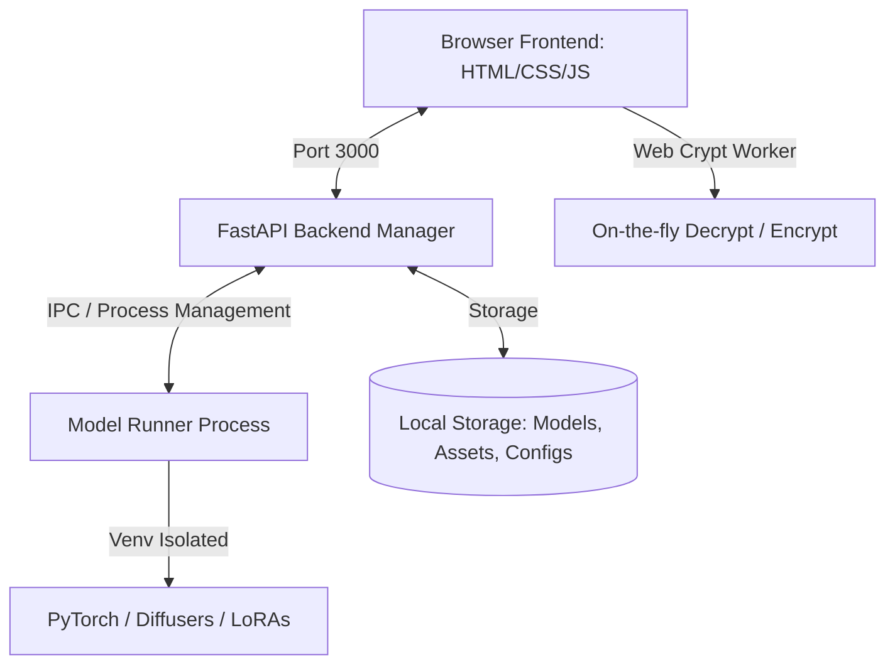

# Pleo: Lightweight Local Model Loader & Runner for RunPod
## Comprehensive Product & Technical Specification

Pleo is a low-complexity, high-performance web interface and runner system designed to load, manage, and execute local machine learning models on RunPod instances. It utilizes isolated virtual environments per model to prevent dependency conflicts, features end-to-end browser-derived asset encryption, and integrates seamless model/LoRA management in a clean, minimalist off-white interface.

---

## 1. System Architecture

### Backend (Python/FastAPI)
- **Port:** Run on port `3000` (serving both the API and the static frontend assets).
- **Process Management:** Manages the active model runner as a subprocess.
- **Auto-Update & Restart:** 
  - Ability to execute `git pull` locally via a setting trigger.
  - Ability to restart the FastAPI process (e.g., using `os.execv` or a watcher wrapper) without tearing down the outer Docker container.
- **Virtual Environments (`venv`):** Manages a directory of venvs (e.g., `/app/runners/envs/<model_name>`) and spawns runners passing the appropriate virtual environment's Python interpreter path.

### Frontend (HTML/CSS/JS)
- **Stack:** Vanilla HTML5, Vanilla CSS (custom properties for styling), and Vanilla Modern JS. No heavy frameworks (React/Vue/Next.js) unless explicitly requested.
- **State Persistence:** Local storage/state management in the browser keeps track of active inputs, selected LoRAs, strength settings, and generation parameters across refreshes or navigation changes.

---

## 2. Core Features & Functional Requirements

### 2.1 Boot, Authentication & Encryption at Rest
- **Login / Sign Up:** Screen presented on initial load (boot).
- **Key Derivation:** Use PBKDF2 (or Argon2) in the browser to derive a cryptographic key from the user's login password.
- **Encryption at Rest:** 
  - All generated assets, uploaded reference images, and keys (Hugging Face, Civitai) are encrypted *in the browser* using the derived key (via Web Crypto API inside a Web Worker/Service Worker) before being sent to the backend.
  - The backend stores only the encrypted blobs on disk.
  - When viewing assets, the browser fetches the encrypted data and decrypts it on-the-fly.

### 2.2 Collapsible Sidebar Navigation
A clean collapsible sidebar containing the following routes:
1. **Running:** 
   - Control panel for active generations.
   - Real-time generation progress/step-viewer.
   - Action to cancel the current generation.
   - Option to delete local model weights.
2. **Models:**
   - List of available models (Z Image Base, Z Image Turbo, etc.).
   - Launch, download, and status indicators.
3. **Assets:**
   - Grid/Carousel of generated images and reference images.
   - Visual metadata viewer.
   - Deleting an asset removes it from disk and metadata index.
4. **LoRAs:**
   - Separate download tabs for Hugging Face and Civitai.
   - Combined list of locally downloaded LoRAs.
   - Option to delete local LoRAs.
5. **Data Studio (Planned):** 
the idea here, would be add or pull assets from hugging face or upload, then qwen 2.5b or simiolar image model, auto captions a data set before you send it to the trainier
so the relation ship between this and triaining is tighlty copupled, you will need to make sure the model is also running in its own enviorment and that you can stop it, delete weights etc 
6. **Training (Planned):** 
z image and qwen character lora training; data set, captions, trigger word generation and auto adding to captions for you, save to hugging face on completion, 
save steps of every 250, 500, 750, 1000, 1500, 2000 allow manual save too 

traiing setps of 250 up to 20k in steps of 250 but allow manual step counts too, say someeone wants 300 

est completion time, allow entering runpod hr rate and then caluclate time based on step completion time, and est cost based on time till completion and entered rate; 

makes sure theres the expected options for traninig, and also make sure this model works in isolationl; allow deleteing, assets, model weights, cached items, training bits etc 

also need steps for and prompts for checkpoint images based on the current checkpoint, so you can see examples, for each training checkpoint; 

### 2.3 Settings Menu
- **API Credentials:** Fields to save Hugging Face and Civitai API keys (stored encrypted).
- **Git Updater:** Pull repo button (`git pull`) to fetch latest changes without restarting the Docker container.
- **Backend Reloader:** Button to restart the FastAPI server programmatically.
- **Content Moderation Pipeline:** 
  - Lazy-loaded, small on-device/local image classifier (e.g., lightweight NSFW/safety filter). prevent images from being saved, check ref images too. 
  - Developer toggle (On/Off) in the settings menu to enable/disable.

---

## 3. Model Runner & Generation Engine

### 3.1 Model Environment Isolation
- Each model configuration must reside in its own subdirectory and utilize its own virtual environment (`venv`).
- PyTorch and base dependencies are shared or linked, but model-specific library versions (like `diffusers`, `transformers`, or custom kernels) are installed separately per model.
- **Target Models:**
  - **Z Image Base:** Optimized for high-quality outputs and training compatibility.
  - **Z Image Turbo:** High-speed inference model (CFG scale defaults to 0).
  - **Qwen Image 2512:** Image generation model.
  - **Qwen Image Edit 2511:** Image editing model.

### 3.2 LoRA Integration & Stacking
- **Civitai Support:** Download using URL inputs. The parser must check for `civitai` in the domain string rather than forcing `.com` (allowing for `.org`, CDN links, or other proxies). Allow the link to show the various items in a modal so you can click which to download; 
- **Hugging Face Support:** Download using HF Repo IDs and filenames.
- **LoRA Stacking:** 
  - A UI modal allowing users to select multiple local LoRAs to inject into the current model pipeline.
  - Adjustable strength sliders (e.g., `-2.0` to `2.0`, defaulting to `1.0`) per active LoRA.

### 3.3 Generation Queue & Viewer
- **Streaming Noise:** Step-by-step progress/noise images are streamed to the client (via WebSockets or SSE) during generation. 
- **Aspect Ratio Matching:** The preview container must dynamically resize to match the target generation resolution so previews are not squashed or clipped.
- **Resolution Options:** 
  - Standard squares (512x512, 1024x1024).
  - Portrait and Landscape presets in both standard and Full HD (e.g., 1080x1920, 1920x1080).
- **Default Parameters:** Standard defaults tailored to the selected model (e.g., CFG scale = 0 for Z models, seed defaults, step count).
- **Generation Queue:** A sequential queue system that queues generation tasks when the runner is busy. The queue is rendered in a dedicated section below the generation viewer.
- **Fullscreen Lightbox:** 
  - An expandable full-view container for generated images.
  - Close button ("X") must be positioned in the corner *outside* of the image boundary to prevent overlaying the output.
  - Sized appropriately to the image's native resolution ratio to avoid cutoff.

---

## 4. Visual Design & Theme

- **Palette:** Off-white background (`#F9F9FB` / `#FFFFFF`) with sharp charcoal/black typography (`#111111`).
- **Aesthetic:** Minimalist, high contrast, industrial, and clean. Minimal borders, subtle shadows, and premium layout structure.
- **Responsive Design:** Native optimization for both mobile and desktop screen sizes, featuring a collapsible navigation drawer at the bottom of the screen on mobile and on the left side on desktop.

---

## 5. Docker Container Specification

- **Base:** Lightweight CUDA-enabled base image containing system-level dependencies (CUDA, CUDNN, basic Python development headers, git). Rely on pulling the git repo from github over needing to rebuild the base image after the main requrements are in the container; 
- **Caching:** Pre-cached base PyTorch and torchvision packages to minimize container size and build time.
- **Volume Mounts:** Mount directories for models, LoRAs, and assets to ensure data persistency across RunPod instances. mount to /workspace
